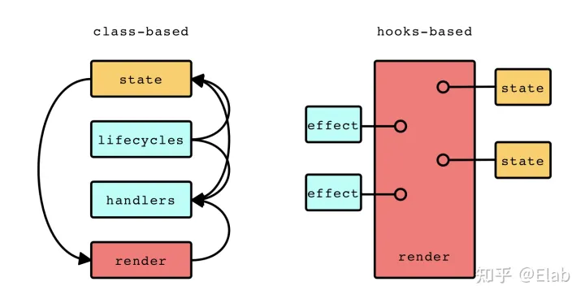

# React Hook 的理解与使用

## 什么是 React Hook

_Hook 是 React 16.8 的新增特性。它可以让你在不编写 class 的情况下使用 state 以及其他的 React 特性_

在 16.8 之前的版本中，组件一般可以分为两类：

- 基于 **类** 的组件
  - 具有自身的状态 `state`
  - 具有生命周期 `componentDidUpdate` 等
  - 具有组件实例

```javascript
class MyClassComponent extends Componet {
  constructor() {
    this.state = { count: 1 };
  }

  componentDidUpdate() {
    console.log(this.state.count);
  }

  render() {
    const { count } = this.state;
    return <div>{count}</div>;
  }
}
```

- 基于 **函数** 的组件
  - 没有状态
  - 没有生命周期
  - 没有组件实例
  - 纯粹的 `data -> view` 映射

```javascript
function MyClassComponent(props) {
  const { count } = props;
  return <div>{count}</div>;
}
```

在 `Hook` 的加持下，函数组件具有了状态(`useState`)，具有了类似于生命周期的副作用处理函数(`useEffect`)，并且在当前 React 的架构体系下，`function-based componet + hook` 的形式比 `class-based component` 更适合。



从上图可以看出，`class-based` 的组件对应的视图由 `render` 产生，在业务需求下进通过实例上的回调函数和生命周期进行 `state` 的维护及副作用的处理，所以执行顺序可能是多变的（箭头），但是在 `hooks-based` 的组件中，组件函数本身便会产生视图，`state` 及 `effect` 的维护及处理都是从上至下的。

所以在 `hooks-based` 的组件下的思维逻辑不能照搬类组件，因为其本身是没有实例和生命周期。 由于函数组件本质上就是一个产生视图的函数，所以我们可以以 **帧** 或者 **快照** 的形式来看待函数组件，每一次的渲染都会产生新的帧，并且新旧帧之前没有任何联系。

## useState

`useState` 用于维护组件的的基本状态，其返回一个数组。

```javascript
const [state, setState] = useState(0);
```

`useState` 可以传入一个值作为初始值，也可以传入一个函数，其返回值将作为初始值。

通过解构语法我们将其分为数据 `state` 和数据的更新 `setState`。`state` 和 `setState` 只是普通的 JavaScript 变量，所以也可以命名为其他名字。

更新 `state` 需要調用更新函数 `setState` (或者其他名字)，可以直接传入一个值。

```javascript
setState(state + 1); // state 等于 1
```

也可以传入一个函数，这个函数的参数是当前的 `state`

```javascript
setState(state => state + 1); // state 等于 1
```

如果前后的 `state` 完全相等则会跳过渲染

```javascript
setState(state => state); // 不会造成渲染
```

在 `class` 组件中我们通过 `setState` 来维护内部状态，在 `hook` 中返回的 `setState` 的作用和其基本一致，不过不会对 `state` 进行自动合并，所以在函数组件中如果 `state` 是对象，那么调用 `state` 时也需要传入完整的对象。

```javascript
const [state, setState] = useState({ name: "Yuki", age: 18 });

function Person({ initialCount }) {
  const [info, setInfo] = useState({ name: "Yuki", age: 18 });
  const handleNameChange = e => {
    setInfo({ name: e.target.value });
  };
  const handleAgeChange = e => {
    setInfo({ age: e.target.value });
  };
  return (
    <>
      <input onChange={handleNameChange} value={info.name} />
      <input onChange={handleAgeChange} value={info.age} />
    </>
  );
}
```

上述代码中任一输入框内的内容变更都会导致其他的输入框的内容被设置为 `undefined`。可以修改为下列代码：

```javascript
const [info, setInfo] = useState({ name: "Yuki", age: 18 });
const handleNameChange = e => {
  setInfo({ ...info, name: e.target.value });
};
```

如果需要维护多个状态则需要多个 `useState` 的使用。

```javascript
const [name, setName] = useState("Name");
const [surname, setSurname] = useState("Surname");
```

## useEffect

函数组件在理解上比较接近于纯函数，每个组件可以看作是一次渲染的快照，所以在函数主体内不适合进行副作用的处理，比如 DOM 操作、网络请求、设置定时器等。应当将这些操作移至 `useEffect` 中。

`useEffect` 是 React 的纯函数式世界通往命令式世界的逃生通道。它接收一个包含命令式、且可能有副作用代码的函数。

```javascript
useEffect(() => {
  ChatAPI.subscribe();
});
```

一般来说，在进行事件订阅后需要在某种情况下进行订阅的取消，所以传递给 `useEffect` 的函数需返回一个清除函数。

```javascript
useEffect(() => {
  ChatAPI.subscribe();
  return () => {
    ChatAPI.unsubscribe();
  };
});
```

`useEffect` 默认情况下会在每轮渲染结束后执行，也可以通过传递第二个参数进行控制。

```javascript
useEffect(() => {
  ChatAPI.subscribe();
  return () => {
    ChatAPI.unsubscribe();
  };
}, []);

useEffect(() => {
  ChatAPI.subscribe(id);
  return () => {
    ChatAPI.unsubscribe(id);
  };
}, [id]);
```

`useEffect` 会根据第二个参数的内容控制其副作用是否执行，如果传递是空数组，则只会在组件挂载时执行副作用，组件卸载时执行清除函数，如果数组中有值，则会在该值改变时执行上一个清除函数并执行新的副作用。

> React 18 之前 `useEffect` 中的函数会在浏览器完成布局与绘制之后在一个延迟事件中被调用，但是在之后的版本中如果它是离散的用户输入（如点击）的结果时，或者它是由 `flushSync` 包装的更新结果时，传递给 `useEffect` 的函数将在屏幕布局和绘制之前同步执行。（_如果并发模式下单个 work 的执行比较快也会导致同步执行_）

## useLayoutEffect

`useLayoutEffect` 的函数签名与 `useEffect` 相同，不同的是它一定会在所有的 DOM 变更之后，浏览器执行绘制之前同步进行调用副作用函数，并且其内部的更新也会被同步刷新。

## useContext

作为单项数据流的 React 来说，跨组件的数据共享是一件很麻烦的事情，我们需要将子/孙组件中用到的数据提升到一个公共的父/祖组件中，这样的话数据的传递可能会跨越很多层，并且大部分的中间组件都不会用到这样的数据。为此，React 提供了 `context` 这样的设置来达到数据共享的目的。

```javascript
const themes = {
  light: { bkColor: "#FFF", color: "#000" },
  dark: { bkColor: "#000", color: "#FFF" },
};

const ThemeContext = createContext(themes.light);
```

通过 `createContext` 函数可以创建一个 `context` 对象。`ThemeContext`

```javascript
<ThemeContext.Provider value={theme}>
  <div>hello world</div>
</ThemeContext.Provider>
```

`Provider` 内的所有子组件都可以访问到 `value`。

```javascript
const value = useContext(ThemeContext);
```

`useContext` 接收一个 `context` 对象作为参数并返回该 `context` 的当前值。当前的 `context` 值由上层组件中距离当前组件最近的 `ThemeContext.Provider` 的 `value` 决定。

当前 `ThemeContext.Provider` 的 `value` 发生变化时，所有订阅该 `context` 的自组件都会重新渲染。

## useReducer

```javascript
function reducer(state, action) {
  switch (action.type) {
    case "increment":
      return { count: state.count + 1 };
    case "decrement":
      return { count: state.count - 1 };
    default:
      return state;
  }
}

const [state, dispatch] = useReducer(reducer, { count: 0 });
```

`useReducer` 可以看作是 `useState` 在复杂计算下的替代方案。它接受一个 `(state, action) => newState` 的 `reducer` 函数并返回一个 `state` 及用以发送 `action` 的 `dispatch` 函数。

如果采用 `useState` 的话上面的代码会被改写为：

```javascript
const [state, setState] = useState({ count: 0 });
function reducer(action) {
  switch (action.type) {
    case "increment":
      setState({ count: state.count + 1 });
    case "decrement":
      setState({ count: state.count + 1 });
    default:
  }
}
```

使用 `useReducer` 可以更好地组织用以更新 `state` 的代码，而且由于 `dispatch` 本身的引用是不会改变的，所以可以更加放心的将其传递给组件。

## useImperativeHandle

```javascript
useImperativeHandle(ref, () => {
  return {
    focus: () => {
      inputRef.current.focus();
    },
  };
});
```

`useImperativeHandle` 可以让你在使用 `ref` 时自定义暴露给父组件的实例值。

## useDeferredValue

```javascript
const deferredValue = useDeferredValue(value);
```

`useDeferredValue` 接受一个值并返回该值的新的值，`deferredValue` 的更新会在更紧急的更新之后，如果当前的更新是一个紧急的更新，比如用户输入，那么 `deferredValue` 便是之前的，在紧急更新之后会立即进行更新。

如果不是一个紧急的更新则会立即返回最新的值。

## useTransition

```javascript
const [isPending, startTransition] = useTransition();
```

`useTransition` 返回一个过渡状态及一个过渡任务的启动函数。

在前端开发中视图的响应是尤为重要的，但是不同交互更新是有着不同的优先级的。比如说输入框、滑块这些交互的更新的优先级就很高，但是其值的附属更新优先级就比较低。

`startTransition` 允许我们将某些任务标记为低优先级任务，这样在进行协调时低优先级的任务就会给高优先级的任务让步，让其优先协调并更新界面，在没有更高优先级的情况下再对低优先级的任务进行协调并更新界面。

`isPending` 表示该任务的更新状态，以便提供等待状态。

需要注意的是 `startTransition` 本质上的执行是同步的，只是它所影响的更新可以被打断罢了，所以如果过渡任务本身就很耗时还是会出现卡顿。

## useDebugValue

```javascript
useDebugValue(value);
```

`useDebugValue` 可用于在 React 开发者工具中显示自定义 hook 的标签。

## 其他 hooks

- `useId` - 应用于服务端渲染保证水合时客户端和服务端的组件是否一致
- `useSyncExternalStore` - 一般用于状态管理库
- `seInsertionEffect` - 一般用于 `css-in-js` 的第三方库

## 自定义 hook

除了自带的 `hook` 外，我们还可以实现自己的 `hook` 来进行逻辑的复用。

```javascript
import { useState, useEffect } from "react";

function useCursor() {
  const [cursor, setCursor] = useState({ x: 0, y: 0 });
  useEffect(() => {
    const func = e => {
      setCursor({
        x: e.x,
        y: e.y,
      });
    };
    window.addEventListener("mousemove", func);
    return () => {
      window.removeEventListener("mousemove", func);
    };
  }, []);

  return cursor;
}

export default useCursor;
```

上面的代码创建了一个名为 `useCursor` 的自定义 hook，作用实时获取鼠标的位置信息。使用自定义 `hook` 和普通 `hook` 一样，只需要引用并使用即可。

```javascript
const { x, y } = useCursor();
```

## 规则

`hook` 本身时 `JavaScript` 函数，但是它可以和 React 进行通信所以有一定的使用规则。

- 只能在最顶层使用 `hook`，不要在循环，条件或嵌套函数中调用
- 只在 React 函数中调用 `hook`
- 自定义 `hook` 以 `use` 开头
